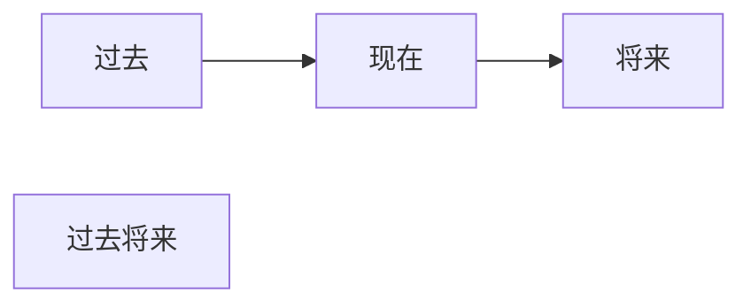
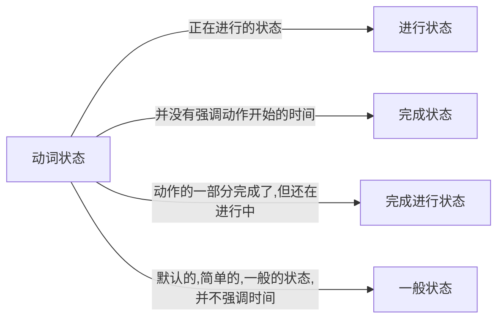
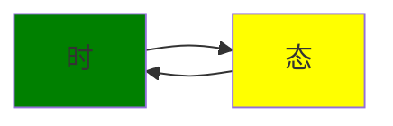
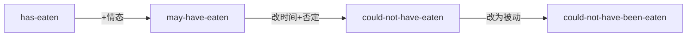

# 动词时态

---

编写时间: 2022-8-8
最近更新时间: 2022-8-8

---

### 动词时间



过去将来:相对于过去时间点的将来时间

### 动词状态



---

**总结:时态=动作的时间+动作的状态**



### 时态

- 过去时
  
  - 过去进行时态: 相对于过去正在进行的动作
  
  - 过去完成时态: 相对于过去完成的动作
  
  - 过去完成进行时态: 相对于过去做了一部分且没有做完的动作
  
  - 过去一般时态:相对于过去没有指出时间的动作

- 将来时(省略)

- (省略)

判断方式(个人感觉):如"你等着,我一定来咬你",先判断时间为过去将来时,再判断状态为一般状态(没有指出时间的发生点)



### 时态详解

#### 现在时间

---

##### 一般现在时态

语法: +动词原形 (三单状态)

1. 表达**事实**

2. 表达**习惯/重复的动作**

3. 表示**预计发生的事**

---

##### 现在进行时态

语法: 助动词be的变位+动词的现在分词

be动词

1. (连)系动词
   I am a student -> I = a student

2. 助动词用于构成时态

---

##### 现在完成时态

语法: 助动词have的变位 + 动词的过去分词

***强调:过去分词 != 过去式***

---

##### 现在进行完成时态

做道数学题:

```text
现在进行完成时态 = have的变位 + (动词的过去分词 + be的变位) + 动词的现在分词 = have的变位 + been + 动词的现在分词
```

---

#### 过去时间

##### 一般过去时态

 语法: +动词过去式

 一般:

| 动作状态   | 是否可知(T/F) |
|:------:|:---------:|
| 动作发生了  | T         |
| 动作多久   | F         |
| 动作何时开始 | F         |
| 动作何时结束 | F         |

现在的习惯动作 : 过去的习惯动作

I **paly** basketball : I **used to play** basketball 

---

##### 过去进行时态

语法: be的过去式 + 动词的现在分词 

---

##### 过去完成时态

语法: have的过去式 + 动词的过去分词

```text
I had eaten ......
```

---

##### 过去完成进行时态

语法: 

```text
Has been eating ==> had been eating
```

---

#### 将来时间

##### 一般将来时态

语法:`will(shall) + 动词`

---

##### 将来进行时态

 语法:`will(shall) + be + 动词的现在分词`

---

##### 将来完成时态

语法:`will(shall) + have + 动词的过去分词`

在将来的一个时间点前完成动作并且影响到那个时间点的变化

---

##### 将来完成进行时态

语法: `will(shall) + have的变位 + been + 动词的进行时态`

---

#### 过去将来时间

##### 一般过去将来时态

语法：`would + 动词原形`

Would的多义

1. will的过去式变位构成时态

2. 构成虚拟语气
   
   ```
   If I were you,I would eat a carrot
   如果我是你,我会吃一根胡萝卜
   ```

3. 疑问词

---

##### 过去将来进行时态

语法: `Would + be + 动词的现在分词`

---

##### 过去将来完成时态

语法: `Would + have + 动词的过去分词`

---

##### 过去将来完成进行时态

语法: `Would + have + been + 动词的现在分词`
