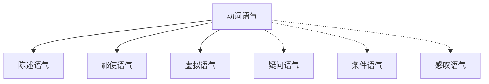
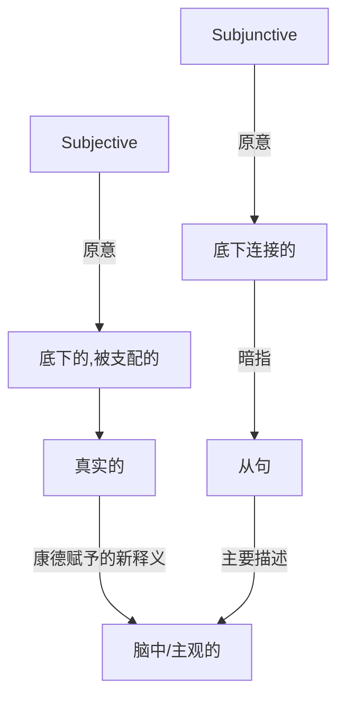

### 动词语气分类

---

编写时间:2022-8-8

最近更新时间:2022-8-8

---




---

##### 陈述语气

描述现实,如:The rabbit ate the carrot!

---

##### 祁使语气

命令,请求,如:You, go to school

1. 用第二人称("你")用一般现在时态

2. 去掉"你"并保证动词原形
   
   ```text
   You eat the carrot => Eat the carrot
   You are quiet! => Be quiet!
   You never give up! => Never give up!
   ```

---

##### 虚拟语气

这是英语演变过程中一个优美的巧合:



***如果是脑中想象的尤其是与现实不符合(相反)的,则使用虚拟语气***

特制脑中想象的但现实中没有发生的

如果"现在发生什么就做什么",就把时间段往前推一段时间

*If I see the rabbit **now**, I **will** bite him.* 

以上这句话是错误的,应该改成:

*If I **saw** the rabbit now,I **would** bite him.*

如果和将来事实相反(可能性很小):

*If I **should see** the rabbit tomorrow,I **would** bite him.*

如果"过去要是发生什么就会有什么",和过去事实相反:

*If I **had seen** the rabbit **a few days ago**,I **would have bitten** him*

***虚拟语气两大用法之一: "不可能"的假设***

| 时间    | 条件句         | 主句                | 释义                                                                          |
|:-----:|:-----------:|:-----------------:|:--------------------------------------------------------------------------- |
| 与现在相反 | 过去式         | would+动词原形        | 如:If I **were** you,I **would** ......<br/>言下之意:我不(可能)是你                    |
| 与将来相反 | should+动词原形 | Would + 动词原形      | 真的不可能:兔子下蛋(客观上的事实,假命题)<br/>可能性很小:我能进年级前十<br/>shall(原形) ==> should(过去式)<br/> |
| 与过去相反 | had+动词过去分词  | would have+动词过去分词 | 言下之意:我之前并没有......                                                           |

***虚拟语气两大用法之二:愿望,请求,建议,命令...***

`wish`可能性小的

`hope`比较中性

- 对现在的愿望

wish+动词过去式

```text
I wish that I were a pony in Equestria.
```

- 对过去的愿望

wish + had/(would have) + 动词的过去分词

```text
I wish (that) I had eaten the carrot.
我希望我吃了那根胡萝卜。
```

- 对将来的愿望

wish + (would/could/might/should) + 动词原形


