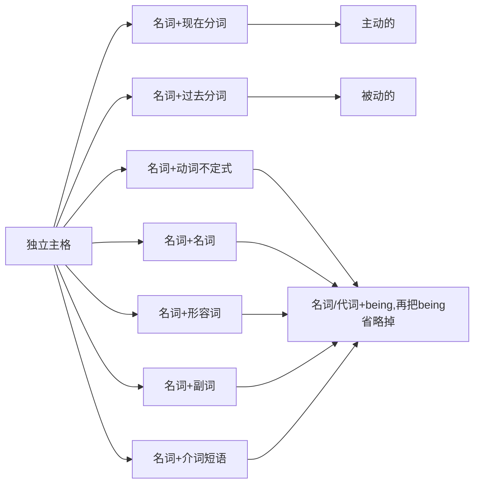

# 独立主格

---
编写时间: 2022-8-12

最近更新时间: 2022-8-12

---

**简化句子，可以简化因果句等，去掉前缀**

例：

```text
Because the wolf invited him the rabbit decided to go to the party.
```

简化后：

```text
The wolf inviting him, the rabbit decided to go to the party.
```

1. 省略Beacuse
2. 因为狼邀请兔子属于主动所以要改为现在分词

这个动作是`the wolf`发出的而并非真正的句子主语`the rabbit`发出的

<span style="color:skyblue">***语法上把`the wolf`称为动词`invite`的逻辑主语，即句子中的主格***</span>

<span style="color:#dd33ee">**独立指独立于句子中主语的"主语"**</span>



