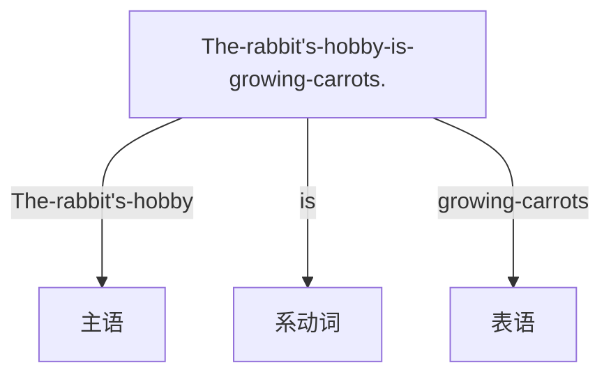
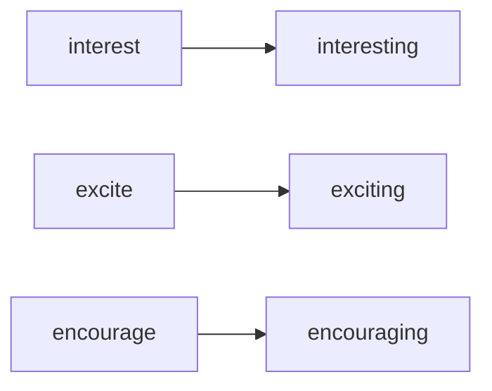

# 非谓语动词
---
编写时间: 2022-8-10

最近更新时间: 2022-8-11

---

***定义：不能表达时间与人称等的动词叫做"非限定性动词"，即"非谓语动词"(如eating, to eat, talking......)***

一个简单句只能有一个谓语动词，其他的动词都是非谓语动词，且如果有两个简单句需要用连词

### 动词不定式

##### 不定式作主语

如"to eat",无法知道描述的对象，例：

```text
To eat a carrot every day is important for a rabbit.
```

这句话可以改写成:

```text
It is important for a rabbit to eat a carrot every day.
```

##### 不定式做宾语

```text
The rabbit likes to eat carrots.
```

此时"to eat"为"likes"的宾语

##### 不定式作宾语补足语

"it"也可以做宾语，

```text
I consider it important to eat a carrot every day.
```

其中的consider为[复杂及物动词](./句子成分.md#谓语动词)，"it"后面的，为宾语补足语，"consider it important"无法说明描述的对象

##### 不定式作定语

```text
The rabbit has a lot of carrots to eat.
```

"to eat"放在后面，"a lot of carrots"与"to eat"是一种动宾关系

##### 不定式作状语

- 表原因

I was surprised to get a new computer.

这里表示"我"吃惊的原因

- 表目的

I will do something to get a computer.

这里表示"我"做一些事的目的

- 表结果

I got enough money to buy a new computer.

这里表示"我"得到足够的钱的结果

### 非谓语动词的高级用法

```text
The rabbit seenmed to be eating a carrot
```

***注意：非谓语动词可以与时态结合但还是无法表述具体的时间***

### 动名词

##### 动名词作主语

```text
Carrots are healthy for the rabbit.
```

用动名词(组)来替换Carrots:

```text
eating carrots is healthy for the rabbit.
```

##### 动名词作主语补语(表语)



##### 动名词作定语

a <span style="color: green">sleeping</span> pill

##### 动名词作宾语

```text
// 以下两句话意思一样
The rabbit likes to eat carrots.
The rabbit likes eating carrots.
```

介词 + 动名词

例: fond of eating 喜欢吃

***特殊注意：***

有的介词+动名词容易被弄混

***look***ing ***forward*** ***to*** <span style="color: orange">***seeing***</span>

这里的to是介词，seeing为动名词

***不是动词不定式的"to"!***


### 现在分词

***注意：现在分词不一定自带现在的时间属性！！！***

###### 现在分词作形容词



##### 现在分词作宾语补足语

The wolf saw the <span style="color:orange">rabbit(宾语)</span> <span style="color: green">eating(宾语补足语[正在])</span> a carrot

The wolf saw the <span style="color:orange">rabbit(宾语)</span> <span style="color: green">eat(宾语补足语[全程])</span> a carrot

两者区别于强调的状态

##### 现在分词作状语

例：

```text
hearing the news
听到这个消息
// 相当于一个时间状语从句
```

```text
Not knowing what to eat,the rabbit skipped lunch.
不知道吃什么，这个兔子没有吃午饭
// 相当于一个原因状语从句
```


### 过去分词

***同样，过去分词也不带时间属性，不能表达时间***

##### 过去分词作形容词

a <span style="color: green">painted</span> room

刷过油漆的房间

过去分词作形容词就相当于描述已经形容过的名词

很多过去分词短语要后置

##### 过去分词作主语补语

The rabbit is <span style="color: green">interested</span> in growing carrots.

这里的interested就是表达对......感兴趣

|         形式          |                    描述                    |
| :-------------------: | :----------------------------------------: |
| interesting(现在分词) | 是主动的，表述的是描述的对象让人感到有兴趣 |
| interested(过去分词)  |   是被动的，描述的是某个对象感到很感兴趣   |

##### 过去分词作状语

- Seen 看(表示地点)[被动]
- Born 由于(表示原因)
- Given 如果再给(表示条件)


